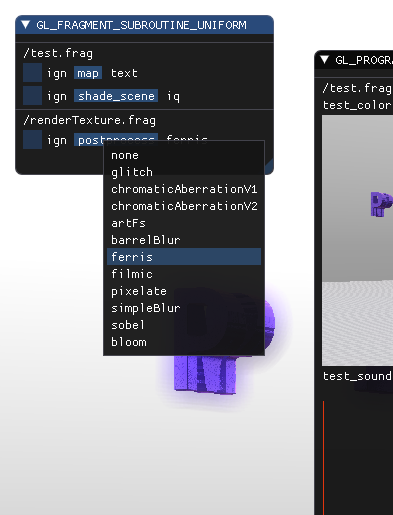

Specializing Resources
======================

This chapter will focus on how we update the resources managed by the ``ProgramInspector``.

Recalling the definition of named_resource and resource:

.. code-block:: cpp
   :linenos:

   using property_t = std::map<gl::GLenum, gl::GLint>;

   struct resource {
     resource(gl::GLuint resourceIndex, property_t properties);
   
     gl::GLuint resourceIndex;
     property_t properties;
   };

   struct named_resource : public resource {
     named_resource(std::string name, resource res);
     virtual void draw2D();
     virtual ~named_resource() = default;
     std::string name;
   };

We've talked in about what ``named_resource::draw2d`` does and but never how Dear ImGui supports this.

ImGui and Resources
-------------------

This will be kept brief and is just here for completeness sake.
When ``Programinspector::draw_gui`` is called, all resources receive a call on their ``draw2d`` method.
Dear ImGui allows to not only draw information about the resource, but also modify a value, when provided.
Exemplary for values of float:

.. code-block:: cpp
   :linenos:

   ImGui::DragFloat ("var_name1", &value[0]);
   ImGui::DragFloat2("var_name2", &value[0]);
   ImGui::ColorEdit3("var_name3", &value[0]);
   ImGui::ColorEdit4("var_name4", &value[0]);

These functions are provided a label and a pointer to the value.
ImGui will then paint the representation of the values and allow modification through various means.
For ``ColorEdit*`` it also provides drag & drop functions to copy values.
This allows us to change the values of the resources through interaction with the GUI.

Unnamed Resources
-----------------

As you might have noted, ``resource`` does not provide a a method for drawing.
With OpenGL 4.6, there are two interfaces with unnamed resources: ``GL_ATOMIC_COUNTER_BUFFER`` and ``GL_TRANSFORM_FEEDBACK_BUFFER``.
For abstractions sake they were included, but since I've not yet come up with a use for these, they are not drawn.

.. warning::

   Expect weird behavior when you use these! These interfaces are completely untested.

Resource Properties
-------------------

This is a non-exhaustive list of resource properties, refer to the OpenGL 4.6 core for the complete list (After Table 7.2).
For breverity we will discuss the ones mentioned throughout this chapter:

GL_TYPE:
  Type information about the resource. used in program output and uniforms

GL_LOCATION:
  The location of the resource, either chosen by OpenGL or explicitly through the ``(location=1)`` specifier in GLSL.
  Not all resources allow setting an explicit location.

Resource Specialization Examples
================================

Specializing named_resources depends heavily on the interface.
Although they share several similarities, most of them are completely different.
We'll be looking at:

- Program Output,
- Subroutine Uniforms,
- Uniforms and
- Uniform Blocks

Program Output
--------------

A program output is denoted by the ``out`` storage qualifier in GLSL, for example in a fragment shader that outputs a white image:

.. code-block:: glsl

   out vec4 color;

   void main() {
       color = vec4(1);
   }

Besides fragment shaders, program output always refers to the ``out`` variables in the *last shader stage* of a program.
Type information is critical, as well as the storage location (GL_LOCATION) of the output.

For simplicity this example, we are assuming full ``RGBA32F`` on an ``out vec4`` and will only handle this type.

.. code-block:: cpp
   :linenos:

   struct ProgramOutput : public named_resource {
     explicit ProgramOutput(named_resource res);
   
     void draw2D() override;
   
     resource_type type;
     gl::GLuint location;
     gl::GLsizei textureLocation = 0;
   };

Each member is initialized through the constructor:

.. code-block:: cpp
   :linenos:

   ProgramOutput::ProgramOutput(named_resource res)
       : named_resource(std::move(res)),
         type{toType(properties.at(gl::GL_TYPE))},
         location{static_cast<gl::GLuint>(properties.at(gl::GL_LOCATION))} {}

``textureLocation`` is the texture id acquired through glGenTexture and will be used to draw the fragment shader output with ImGui.

.. code-block:: cpp
   :linenos:

   void ProgramOutput::draw2D() {
     ImGui::TextUnformatted(name.c_str());
     ImVec2 uv0(0, 1);
     ImVec2 uv1(1, 0);
     ImVec2 region(ImGui::GetContentRegionAvailWidth(),
                   ImGui::GetContentRegionAvailWidth() / 1.7f);
     ImGui::Image(reinterpret_cast<ImTextureID>((intptr_t)textureLocation), region,
                  uv0, uv1);
   }

This will produce the exemplary output:
   

The handler for program outputs is in charge of generating and releasing textures as necessary.
(If you are using a framework that provides texture objects with RAII, you might consider storing the texture as a unique pointer.)
You might also consider to allocate all textures at once, you might do so within ``postInit`` where you'll know the exact number of outputs.

Subroutine Uniforms
-------------------

Generally, subroutines are functions with the same signature.
They allow to select different behavior at runtime without changing the active program.

.. code-block:: glsl

   subroutine vec3 SceneMap(vec3 position); // function signature type declaration
   subroutine uniform SceneMap map;  // uniform instance, can be called like a function
   
   subroutine(SceneMap)
   vec3 rotatingShpere( vec3 p )
   { /* impl*/ }
   
   subroutine(SceneMap)
   vec3 csg_demo( vec3 p )
   { /* impl*/ }

   in vec3 position;
   out vec3 trace_result;
   
   void main() {
      trace_result = map(position);
   }

The above code uses the uniform ``map`` to select which function is used when issuing the draw call.

Handling these SUs is a bit more involved, as reflected in the structure of ``SubroutineUniform``:

.. code-block:: cpp
   :linenos:
      
   struct SubroutineUniform : named_resource {
     SubroutineUniform(gl::GLenum stage, named_resource res);
   
     virtual ~SubroutineUniform();
   
     void draw2D() override;
     virtual void get_update(){}; //this basic impl does not need this.
     gl::GLuint location;
     gl::GLuint num_compatible_subroutines;
     gl::GLuint active_subroutine;
     std::string previous_active = "";
     std::unordered_map<gl::GLuint, std::string> subroutines{};
   };

Location and the number of compatible subroutine are read from the named_resource, the remaining attributes are taken care of by the handler (c.f. prev chapter).
This implementation was further specialized to hand control of active subroutines off to an external source, ``get_update`` is unused here.

.. todo:: link to prev chapter

Notable is the draw2D override, which allows to select the the active subroutines through a popup:

.. code-block:: cpp
   :linenos:

   void SubroutineUniform::draw2D() {
     std::string popupname = "select subroutine##" + name;
     if (ImGui::SmallButton(name.c_str())) {
       ImGui::OpenPopup(popupname.c_str());
     }
     ImGui::SameLine();
     ImGui::TextUnformatted(subroutines.at(active_subroutine).c_str());
     if (ImGui::BeginPopup(popupname.c_str())) {
       for (const auto& [subroutine_index, rname] : subroutines) {
         std::string header = rname + "##" + std::to_string(subroutine_index);
         if (ImGui::Selectable(header.c_str(),
                               subroutine_index == active_subroutine)) {
           active_subroutine = subroutine_index;
           previous_active = rname;
         }
       }
       ImGui::EndPopup();
     }
   }

Uniforms
--------

By far the most complicated resources, Uniforms proved quite difficult to implement properly.
The implementation makes heavy use of abstract base classes and different callback functions.

I've tried a more modular approach to provide good flexibility and code reuse.
So, let's start with the most basic case ``generic_uniform``:

.. code-block:: cpp
   :linenos:
      
   struct gets_updates {
     virtual bool get_updated_value() = 0;
   };
   
   struct can_upload {
     virtual bool upload_value() = 0;
   };
   
   struct generic_uniform : public named_resource, gets_updates, can_upload {
     explicit generic_uniform(named_resource res);
     virtual ~generic_uniform(){};
   
     void update_properties(const generic_uniform &res);
     virtual void init(gl::GLuint program) = 0;
     virtual size_t uploadSize() = 0;
     virtual void *valuePtr() = 0;
   
     void draw2Dpre();
     void draw2D() override;
     void draw2Dpost(std::string extra_text = "");
   
     bool get_updated_value() override;
     bool upload_value() override;
   
     std::function<void()> value_update_fn;
     std::function<void()> value_upload_fn;
   
     bool do_value_upload = true;
     bool do_value_update = true;
   
     gl::GLint block_index();
     gl::GLint location();
     resource_type type();
     gl::GLuint array_size();
   };

It's constructor is calling the base class constructor, nothing interesting.

Starting from the top ``update_properties`` will transfer new properties to the uniform, in case it's location or resource index changed after recompilation.
This is taken care of by the handler, we'll come back to that.

``init`` is called to retreive the initial value of the uniform, when necessary the program id will be provided to read the default value from the shader.
``uploadSize`` and ``valuePtr`` provide the necessary information for usage in uniform blocks.

``draw2Dpre`` and ``draw2Dpost`` will be called through ``draw2D`` so there is less code repetitions.
They draw the index and the tooltip.

``get_updated_value`` and ``upload_value`` are in charge of calling ``value_update_fn`` and ``value_upload_fn`` respectively:

.. code-block:: cpp
   :linenos:

   bool generic_uniform::get_updated_value() {
     if (nullptr != value_update_fn && do_value_update) {
       value_update_fn();
       return true;
     }
     return false;
   }

If a custom update or upload function is set and their toggles are active they are executed.
The functions will later be used in combination with uniform blocks.

The last four functions are shortcuts to access the underlying properties, avoiding the more lengthy map access.

.. note::
   This abstract base class aims to be agnostic of the uniform's value type and provides all functions necessary for sending and retreiving.
   It's what I've found to be the least common denominator.

Typed uniforms
^^^^^^^^^^^^^^

This is the last abstraction before we're getting to the actual types.
Building on generic_uniform, we finally introduce the value storage:

.. code-block:: cpp
   :linenos:

   template <typename T>
   struct UniformWithValueVector : public generic_uniform {
     explicit UniformWithValueVector(named_resource arg)
         : generic_uniform(std::move(arg)),
           value{std::vector<T>(getSize(type()))} {}
   
     size_t uploadSize() override { return value.size() * sizeof(T); }
     void *valuePtr() override { return &value[0]; }
   
     virtual void drawValue() = 0;

     std::function<void(UniformWithValueVector<T> &)> draw_value_fn;
     
     void draw2D() override {
       generic_uniform::draw2Dpre();
       if (draw_value_fn) {
         draw_value_fn(*this);
       } else {
         drawValue();
       }
       generic_uniform::draw2Dpost();
     }
   
     std::vector<T> value;
   };

I've decided to use std::vector as underlying container: this uses less repetitive code than defining all different std::array sizes for all types.
The constructor uses ``getSize`` to find the size of the value vector (e.g. mat4 == 16, vec4 == 4, uvec4 == 4, ...) and initializes the vector accordingly.

After taking care of two pure virtual functions, one additional function is introduced.
``drawValue`` is overridden by all implementations to provide a generic default. If needed ``draw_value_fn`` can be set to provide an override at runtime.

Typed Implementations
^^^^^^^^^^^^^^^^^^^^^

I'll present the solution for integers, the others are analogous.
After getting all the abstractions out of the way, the definition is straight forward:

.. code-block:: cpp
   :linenos:

   struct IntegerUniform : public UniformWithValueVector<gl::GLint> {
     using UniformWithValueVector::UniformWithValueVector;
   
     bool upload_value() override;
   
     void init(gl::GLuint program) override;
   
     void drawValue() override;
   };

I'm not statisfied with the way upload_value is implemented, but that's where we are now.
Type check is done once per call, and the implementation **will** break once ``GL_ARRAY_SIZE`` will assume other values than ``1``.

.. code-block:: cpp
   :linenos:

   bool IntegerUniform::upload_value() {
     if (generic_uniform::upload_value()) return true;
     if (resource_type::glsl_int == type())
       gl::glUniform1iv(location(), array_size(), &value[0]);
     else if (resource_type::glsl_ivec2 == type())
       gl::glUniform2iv(location(), array_size(), &value[0]);
     else if (resource_type::glsl_ivec3 == type())
       gl::glUniform3iv(location(), array_size(), &value[0]);
     else if (resource_type::glsl_ivec4 == type())
       gl::glUniform4iv(location(), array_size(), &value[0]);
     else {
       return false;
     }
     return true;
   }

The same holds for the draw functions.
   
.. code-block:: cpp
   :linenos:

   void IntegerUniform::drawValue() {
     std::string header = name;  // + "(" + std::to_string(uniform.location) + ")";
     if (resource_type::glsl_int == type())
       ImGui::DragInt(header.c_str(), &value[0]);
     else if (resource_type::glsl_ivec2 == type())
       ImGui::DragInt2(header.c_str(), &value[0]);
     else if (resource_type::glsl_ivec3 == type())
       ImGui::DragInt3(header.c_str(), &value[0]);
     else if (resource_type::glsl_ivec4 == type())
       ImGui::DragInt4(header.c_str(), &value[0]);
     else
       ImGui::TextUnformatted(name.c_str());
   }
   
Initializing from the defaults set via GLSL is quite simple.
   
.. code-block:: cpp
   :linenos:

   void IntegerUniform::init(gl::GLuint program) {
     if (location() > 0) gl::glGetUniformiv(program, location(), &value[0]);
   }

.. warning::
   ``glGetUniform`` does not accept a length and will write all values, it is to be taken care the vector can hold its size.

Handling Uniforms
^^^^^^^^^^^^^^^^^

Back to the handler, the benefits of abstraction become more evident.
The uniform handler can be constructed with an external builder which statisfies ``std::function<std::unique_ptr<generic_uniform>(named_resource res)>``.
A default is provided, which is a large switch-case returning the previously established basic uniforms.
This builder is called during ``initialize``:

.. code-block:: cpp
   :linenos:

   std::unique_ptr<named_resource> UniformHandler::initialize(
       ProgramInspector& inspect, named_resource res) {
     std::unique_ptr<generic_uniform> new_uniform = builder(res);
     try {
       // if neither throws, we had a previous run with that uniform.
       auto old_res_idx =
           inspect.GetResourceIndex(gl::GL_UNIFORM, new_uniform->name);  // throws!
       auto& old_res = inspect.GetContainer(gl::GL_UNIFORM).at(old_res_idx);
       {
         auto& old_uniform = dynamic_cast<generic_uniform&>(*old_res);
         // We can now try to restore values.
         if (old_uniform.type() == new_uniform->type()) {
           old_uniform.update_properties(*new_uniform);
         }
       }
       std::unique_ptr<named_resource> new_res = std::move(new_uniform);
       new_res.swap(old_res);
       return new_res;
     } catch (std::out_of_range&) { /*no previous value --> new uniform*/
     }
      
     return std::move(new_uniform);
   }

When ``name`` and ``type`` match with a previously created uniform (e.g. ``initialize`` is called after recompilation), the new properties are copied over and the old uniform is returned.
This is easier than copying all of the previously set members (update/upload functions, value, ...).

With generic_uniform, preparing for the draw call is then as little as:

.. code-block:: cpp
   :linenos:

   void UniformHandler::prepareDraw(ProgramInspector& inspect,
                                    named_resource_container& resources) {
     for (auto& res : resources) {
       auto& uniform = dynamic_cast<generic_uniform&>(*res);
       uniform.get_updated_value();
       uniform.upload_value();
     }
   }

You might have noticed the absence of a catch for ``std::bad_cast``.
This choice is deliberate: in case the builder did not produce a valid generic_uniform.

Sampler Uniforms
^^^^^^^^^^^^^^^^

The exception to the above uniforms is a sampler in GLSL (e.g. ``uniform sampler2D tex_wood;``)

.. code-block:: cpp
   :linenos:

   struct SamplerUniform : public empty_uniform {
     using empty_uniform::empty_uniform;
   
     void draw2D() override;
   
     bool upload_value() override;
   
     bool get_updated_value() override;
   
     gl::GLint boundTexture = 0;
     gl::GLint textureUnit = 0;
     std::string wrap = "clamp";
   };

``empty_uniform`` overrides all pure virtual functions in generic uniform with no-ops, to avoid more boilerplate when the uniform is not meant to hold a value.
The implementation does not implement filters, only wrapping.

.. code-block:: cpp
   :linenos:

   bool SamplerUniform::upload_value() {
     if (generic_uniform::upload_value()) return true;
     if (wrap == "repeat") {
       gl::glTextureParameteri(boundTexture, gl::GL_TEXTURE_WRAP_S, gl::GL_REPEAT);
       gl::glTextureParameteri(boundTexture, gl::GL_TEXTURE_WRAP_T, gl::GL_REPEAT);
     } else if (wrap == "mirror") {  // GL_MIRRORED_REPEAT
       gl::glTextureParameteri(boundTexture, gl::GL_TEXTURE_WRAP_S,
                               gl::GL_MIRRORED_REPEAT);
       gl::glTextureParameteri(boundTexture, gl::GL_TEXTURE_WRAP_T,
                               gl::GL_MIRRORED_REPEAT);
     } else if (wrap == "clamp") {
       gl::glTextureParameteri(boundTexture, gl::GL_TEXTURE_WRAP_S,
                               gl::GL_CLAMP_TO_EDGE);
       gl::glTextureParameteri(boundTexture, gl::GL_TEXTURE_WRAP_T,
                               gl::GL_CLAMP_TO_EDGE);
     }
     gl::glActiveTexture(gl::GL_TEXTURE0 + textureUnit);
     gl::glBindTexture(gl::GL_TEXTURE_2D, boundTexture);
     gl::glUniform1i(location(), textureUnit);
     return true;
   }

Choosing std::string over an enum was to simplify interaction with Shadertoy, explained in the upcoming chapter.

Uniform Blocks
--------------

First of all: Uniform Blocks were not implemented in a way they could be used in another framework.
They were mostly implemented for exploring pros and cons about the API.
This section is more about how uniforms' override functions can be used.

That's why we skip ``initialize`` and go straight to ``postInit``:

.. code-block:: cpp
   :linenos:
   :emphasize-lines: 13-17

   void UniformBlockHandler::postInit(ProgramInspector& inspect,
                                      named_resource_container& resources) {
     auto interface = inspect.GetInterface(gl::GL_UNIFORM_BLOCK);
     try {
       auto& uniforms = inspect.GetContainer(gl::GL_UNIFORM);
       for (auto& res : resources) {
         auto& block = dynamic_cast<UniformBlock&>(*res);
         auto active_vars = interface.GetActiveVariables(
             block.resourceIndex, block.num_active_variables());
         // FIXME on recompile, uniforms that remain in program still have the
         // update function set.
         for (auto& resIndex : active_vars) {
           auto& uniform = dynamic_cast<generic_uniform&>(*uniforms.at(resIndex));
           uniform.value_upload_fn = [&]() {
             auto offset = uniform.properties.at(gl::GL_OFFSET);
             block.upload_data(offset, uniform.uploadSize(), uniform.valuePtr());
           };
         }
       }
     } catch (std::out_of_range& err) {
       std::cerr << err.what() << std::endl;
     }
   }

The highlighted lines also demonstrate the use of ``valuePtr`` and ``uploadSize`` methods.
Uniform block variables carry the property ``GL_BUFFER_DATA_SIZE``, so we can initialize our buffer with it.
The active variables from the uniform block interface contain a subset of resource indices from the uniform interface.
Uniforms that are active in an Uniform Block assume ``GL_LOCATION == -1`` and ``GL_BLOCK_INDEX != -1``.
``GL_OFFSET`` on the uniform will also tell us where in the block it's value is located.

Con: as lines 10 and 11 state, once you move a uniform out of the block, this implementation will crash.
The uniform handler will copy new properties to the uniform, leaving the upload override in place.
With the buffer gone, you'll either experience writes to memory or a straight-up crash with invalid memory access.
This could be solved by implementing a ``preInit`` function, where you might remove the overrides.

Pro: this removes **all** guesswork around ``std140`` and ``std430`` layout qualifiers and enables using vendor specific layouts.
