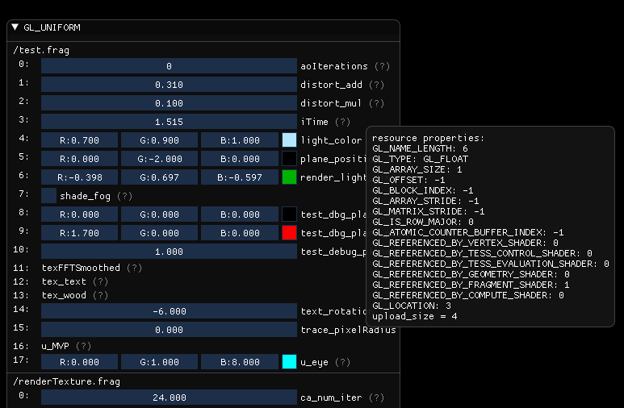

Automating Introspection
========================

Building upon the ``BasicInterface``, there's the ``ProgramInspector`` handling recompilation and automating instrospection.
This is the result for the uniform interface:

This project is using "Dear ImGui" for visualization and glbinding for type safety and some convenience (enum to string conversion).

.. todo::
   
   add link to imgui and glbinding

Goals
-----

``ProgramInspector`` has several objectives and can be tightly bound to the rendering pipeline.

It will:

- scan interfaces for resources
- draw the resource provided by the information
- optionally call handlers for both of the functions

Default behavior
----------------
  
By default, it will require a valid program name (GLuint from ``glCreateProgram``), if you can derive a name for your program you may add it, too.
In case there is more setup necessary, the introspection is delayed until ``initialize`` is called.
When ready to draw the menu, call ``draw_gui(bool*)`` and all interfaces with active resources will be drawn.

It's as simple as

.. code-block:: cpp
   :linenos:

   bool draw_prog_info = true;
   auto program = createProgram(vertSh, fragSh);
   auto inspect = ProgramInspector(program.getId(), vertSh.name + fragSh.name);
   inspect.initialize();
   while (drawLoopActive) {
      inspect.draw_gui(&draw_prog_info);
   }

When no overrides are in place, all named_resource instances generated from the introspection will draw basic information:
The resource index, followed by the name and a ``(?)``.
You can find this in the above screen shot for resources 11-13 and 16.

.. code-block:: cpp
   :linenos:

   void resource_tooltip(const interfaces::types::property_t& props,
                      const std::string& extra_text) {
     ImGui::SameLine();
     ImGui::TextDisabled("(?)");
     if (ImGui::IsItemHovered()) {
       std::ostringstream tooltip;
       tooltip << "resource properties:\n";
       for (auto prop : props) {
         // output the type as string
         if (gl::GL_TYPE == prop.first) {
           tooltip << glbinding::aux::Meta::getString(prop.first) << ": "
                   << interfaces::types::toString(prop.second).c_str() << "\n";
         } else {
           tooltip << glbinding::aux::Meta::getString(prop.first) << ": "
                   << prop.second << "\n";
         }
       }
       tooltip << extra_text;
       ImGui::BeginTooltip();
       ImGui::TextUnformatted(tooltip.str().c_str());
       ImGui::EndTooltip();
     }
   }

   void named_resource::draw2D() {
     ImGui::Text("%2d: %s", resourceIndex, name.c_str());
     resource_tooltip(properties, "");
   }
   
When the ``(?)`` is hovered, the tooltip displays all resource properties.
The property ``GL_TYPE`` is treated differently, it's value would would otherwise be numeric.

Recompiling the Program
-----------------------

In my case, I've wanted to be able to recompile the program and have the changes reflected in my menu.
Read: I add a new uniform in my Shader and when I recompile the program, the inspection displays it.
Since most frameworks are different, you may use ``void set_recompile_function(std::function<gl::GLuint()> fn)`` to add yours.

For me it's:

.. code-block:: cpp
   :linenos:

   gpi_ = std::make_unique<ProgramInspector>(gpuProgram_->getProgramId(), fragSh.name);
   gpi_->set_recompile_function([&]() -> gl::GLuint {
     auto currentProg = gpuProgram_->getProgramId();
     log_.Clear();
     try {
       gpuProgram_->recompileProgram();
       return gpuProgram_->getProgramId();
     } catch (shader_compiler_error& compilerError) {
       log_.AddLog("%s", compilerError.what());
       return currentProg;
     }
   });

When a recompile function was set, the GUI will display a button. Clicking it will then recompile and call ``initialize``.

Advanced Usage
--------------

To arrive at the above screen shot, more steps are necessary.
There are two mechanisms that are provided by the ``ProgramInspector``:

- ``void setHandlerFunction(gl::GLenum interface, handler_fn hdl_fn)`` and
- ``void setHandler(gl::GLenum interface, std::unique_ptr<resource_handler> hdl)``

Handlers are discussed in the next chapter.
For simple tasks, a ``handler_fn`` might be sufficient. We are ``using handler_fn = std::function<named_resource_ptr(named_resource)>``.
Your function is expected to consume the named_resource and return a unique_ptr to a new one, inheriting from named_resource.
If no function was set, the default is to use the named_resource for a unique pointer.

A basic example:

.. code-block:: cpp
   :linenos:
      
   struct fv3 : named_resource {
     fv3(named_resource res) :
     named_resource(std::move(res)), value{} {}
     draw2d() override {ImGui::InputFloat3(name, &value[0]);}
     std::array<float, 3> value;
   }
   
   inspect.setHandlerFunction(GL_UNIFORM,  {
      if(res.properties.at(GL_TYPE) == GL_FLOAT_VEC3) {
        return std::make_unique<fv3>(std::move(res));
      } else {
        return std::make_unique<named_resource>(std::move(res));
      }
   });

.. warning::
   
   ``ProgramInspector`` does prefer complex handlers over handler functions, so when a handler is in place, the function is ignored.

Drawbacks
---------

All state information is held in inspector.
Dynamic casting all the way.
Single handler or function no multimap.
